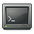

Primer necessitem saber en quin "dev" ho tenim muntat, per això emprem la comanda:

**_$mount_**

ens fa una llista de tot el que hi ha muntat, i ens fixem en els /dev....

si és el "sdb1" (/dev/sdb1), i ara el desmuntem amb:

_**$umount /dev/sdb1**_

i finalment el xequeig amb la comanda "fsck":

_**#fsck /dev/sdb1**_

;)

per saber-ne més:

[manual en anglès](http://www.manpagez.com/man/8/fsck/)
