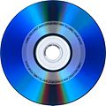

**_Primer que res hem de llistar els lectors gravadors que tenim_** $ _wodim --devices_

_(opció $ wodim --scanbus__)_

wodim: Overview of accessible drives (2 found) : ------------------------------------------------------------------------- 0  dev='/dev/scd0'    rwrw-- : 'SONY' 'DVD RW DW-G120A' 1  dev='/dev/scd1'    rwrw-- : 'LITE-ON' 'DVD SOHD-16P9S' ------------------------------------------------------------------------- $ _cdrecord dev=/dev/cdrom blank=fast_

_**opció**_ $ _cdrecord dev=/dev/scd0 blank=all_
