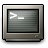

Si volem saber ràpidament una data concreta des de la terminal

només cal escriure:

$ **cal 2 2010** _febrer 2010 dl dt dc dj dv ds dg 1  2  3  4  5  6  7 8  9 10 11 12 13 14 15 16 17 18 19 20 21 22 23 24 25 26 27 28_

$cal "el mes" + "any" en números!
