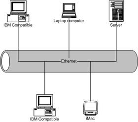

primer que res instal·lar apache2:

**$ sudo apt-get install apache2**

editar el /etc/hosts

**\# gedit /etc/hosts** afegint a la ip local el nom de la web desitjada:

_exemple-> 127.0.0.1    www.inici.cat_

_exemple2> 192.168.0.240 www.inici.cat_

ara només cal editar apache:

**\# gedit** **/etc/apache2/apache2.conf**

afegint al final:

_ServerName www.inici.cat_

A partir d'ara quan qualsevol ordenador de la xarxa local que en el navegador posi www.inici.cat podrà veure la pàgina que tenim al servidor i navegar de forma local.

Si volem personalitzar la nostra pàgina web, només cal editar l'arxiu **index.html** de la carpeta **/var/www**

;)
