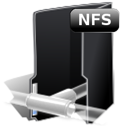

Per poder configurar un servidor NFS hem d'editar l'arxiu _**/etc/exports**_

Aquí podrem decidir quina carpeta volem compartir,  si té permisos de lectura o lectura i escriptura; i també des de quin ordinador es permet l'accés (una sóla IP o tot un rang).

Cal recordar que els permisos que donem estan supeditats als del propi sistema, i són sempre els més restrictius els que prevaleixen!

Per exemple, si volem compartir el _**/home**_ el que farem és editar _**/etc/exports**_ a la terminal:

_**$ gedit /etc/exports**_

introduim el següent text:

_**\# compartim la carpeta HOME del servidor**_

/home 192.168.1.107/255.255.255.0 (rw)

primer la carpeta a compartir i després la IP del client i si té permisos de llegir i escriure (rw) o només lectura (ro)

si volem que ho facin tots els ordinadors podriem posar-ho així:

_**\# compartim la carpeta HOME del servidor**_

/home \*(rw)

;)
