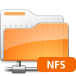

Si volem accedir a una carpeta compartida a través del protocol NFS, necessitem primer instal·lar els paquets portmap i nfs-common, a través de la terminal:

```
sudo apt-get install portmap nfs-common
sudo /etc/init.d/portmap restart
```
Ara només ens cal montar la carpeta a l'ordinador client. Per fer-ho ens cal crear una carpeta on ens muntarà la carpeta del servidor.

_**$ sudo mkdir** **/mnt/carpeta-servidor**_

Finalment només ens cal montar-ho amb la següent ordre:

**$ sudo** **mount -t nfs ip-del-servidor:/carpeta** _**_**/mnt/carpeta-servidor**_**_

Si volem que ens ho monti en iniciar l'ordinador, només cladrà modificar el **_/etc/fstab_** afegint-hi:

**ip-del-servidor:/carpeta** _**_**/mnt/carpeta-servidor nfs
;)**_**_
