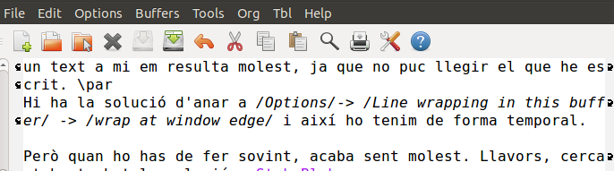

Quan inicies l'emacs amb la configuració per defecte, sempre surten les línies sense estar ajustades. És a dir, que a mesura que vas escrivint i arribes al marge dret la línia continua sense baixar a sota. Això pot resultar útil alguns cops, però quan escrius un text a mi em resulta molest, ja que no puc llegir el que he escrit.

Hi ha la solució d'anar a _Options_\-> _Line wrapping in this buffer_ -> _wrap at window edge_ i així ho tenim de forma temporal.  Però quan ho has de fer sovint, acaba sent molest. Llavors, cercant he trobat la solució a [StokeBloke.com](http://www.stokebloke.com/wordpress/2008/04/24/emacs-line-wrapping/).

Tot i que dóna varies opcions, jo el que he fet ha estat editar l'arxiu de configuració de l'emacs:

$ emacs ~/.emacs

afegir

;; Afegir F12 per alternar ajust de línia
(global-set-key \[f12\] 'toggle-truncate-lines)

Ara quan premo F12, puc anar alternant l'ajust de la línia sense anar al menú superior.

Si volem usaruna altra tecla funció, podem canviar-la.

;)
