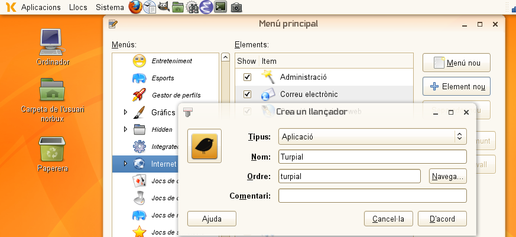
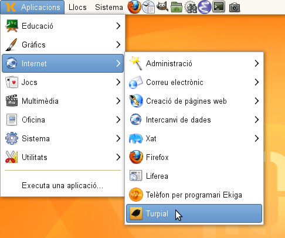
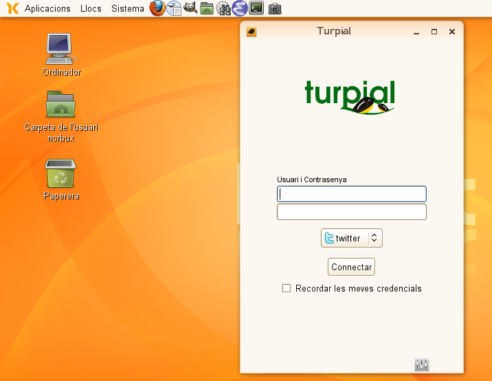

Divendres a la tarda, i amb ganes de llegir les piulades del dia, i com és de costum solc usar el mode d'Emacs per a [Identi.ca](http://identi.ca/) i Turpial per a Twitter.

Com que fa uns dies que vaig instal·lar al meu vell Eeepc901, ara em calia posar-hi el [Turpial](http://turpial.org.ve).  

Aquests passos serveixen tan per la [Linkat](http://linkat.xtec.cat/portal/index.php) com per a [Opensuse](http://www.opensuse.org) 11.x.  

### obtenir Turpial

El primer que cal és baixar el paquet tar.gz de la pàgina oficial

$ wget http://turpial.org.ve/files/sources/stable/turpial-1.5.0.tar.gz

Ara ja tenim el paquet,i el descomprimim:

$ tar -xzvf turpial-1.5.0.tar.gz 

### instal·lar les dependències

El següent que cal fer és instal·lar les depndències:

$ sudo zypper in python-simplejson gtk2-devel python-notify python-pygame 
python-babel gtkspell-devel python-webkitgtk python-setuptools

### instal·lar Turpial

Ara ja ens queda instal·lar turpial, el primer és entrar a la carpeta de turpial:

$ cd turpial-1.5.0/

I executar l'instal·lador:

$ sudo python setup.py install

### nota

Cal comentar que si l'executem des de terminal:

$ turpial

tot anirà bé, o si des de _Aplicacions>Executa una aplicació_ posem **turpial** s'iniciarà. Però no ens ha quedat integrat a l'escriptori, així que podem integrar-lo.  
Anem a dalt de la icona del menú i fent botó dret ens dóna la possibilitat de **Edita els menús** i allí afegim turpial, en el menú _Internet_.

La icona la trobarem a:

/usr/local/lib/python2.6/site-packages/turpial-1.5.0-py2.6.egg/share/pixmaps

 Ara ja només ens queda executar-lo i gaudir de les avantatges de Turpial com a gestor de la xarxa social Twitter i Identi.ca.   ;)

Desitjo que puga servir a molta gent!
