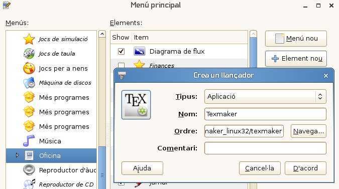
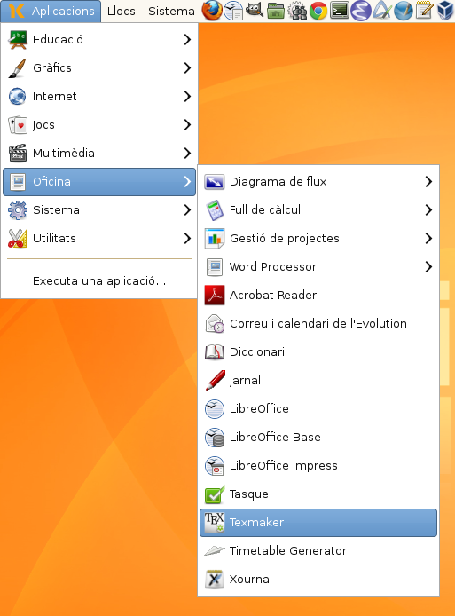
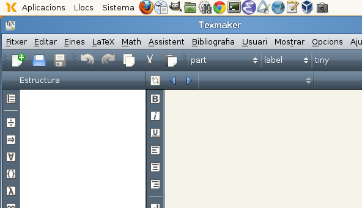

Normalment per escriure en **Latex** utilitzo **emacs** en el seu mode **AUXtex**. Però avui he volgut provar [Texmaker](http://www.xm1math.net/texmaker/) en la [Linkat](http://linkat.xtec.cat/portal/index.php) 4. El principal problema és que als repositoris no està, però tot té solució, sense tocar repositoris, ni afegir cap dependència. És més, si volem podem usar el sistema que explicaré per portar-ho a un llapis USB de forma portable ;-)

### aconseguir el programa

per a 32 bits

wget http://www.xm1math.net/texmaker/texmaker\_linux32.tar.gz 

per a 64 bits

wget http://www.xm1math.net/texmaker/texmaker\_linux64.tar.gz

### descomprir la carpeta

tar -xzvf texmaker\_linux32.tar.gz

### executar Texmaker

Ara ja podem executar-lo directament

cd texmaker\_linux32

### tenir-lo al menú

Si volem tenir-lo a l'ordinador tenim varies opcions. Jo el que he fet és deixar la carpeta dins del /home/usuari però amb un punt al devant, així no no el veig per defecte amb el nautilus, i evitem esborrar-lo per error.

Així la carpeta queda home/usuari/.texmaker\_linux32/

Si es vol es pot copiar a un altre lloc de l'arrel, per exemple /opt o on es vulgui.

Ara només queda posar-lo al **Menú**

Anem a dalt de la icona del menú i fent botó dret ens dóna la possibilitat de _Edita els menús_ i allí afegim Texmaker, en el menú _Oficina_.

La icona la trobarem a: home/usuari/.texmaker\_linux32/texmaker.svg

Ara ja el tenim al Menú…

només ens queda executar-lo.

Desitjo que puga servir a molta gent!
