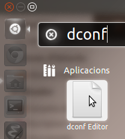

Porto uns dies al netbook usant Ubuntu 11.10 amb Unity, i m'havia desaparegut l'IBUS que uso per escriure en Xinès. No hi havia manera que funcionés. Finalment he trobar la solució: 1, instal·lem dconf-editor: **sudo apt-get install dconf** 2, executem dconf-editor

3, i anem a ... 

Un cop aquí, cal afegir **'Ibus'** i fem RETORN. Ara ja ho tenim funcionant!

