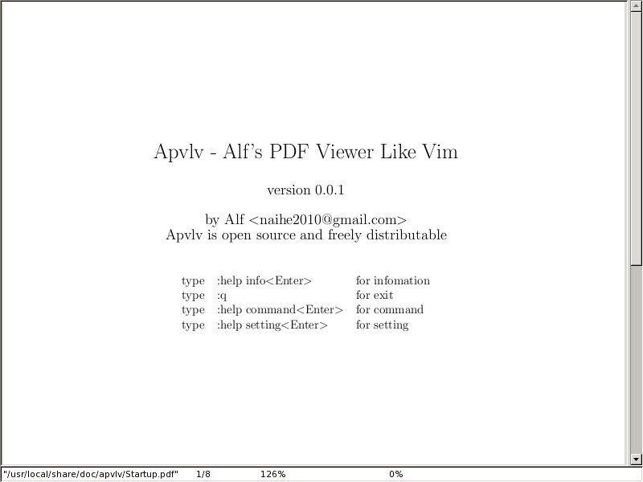

Moltes vegades em trobo amb PDF cada cop més pesats, i per passar de pàgina a pàgina, triga una mica, sobretot en els netbooks.

La idea és, per a què consumir recursos en l'eina, quan els podem aplicar tots a la feina?

Aquí entra en joc [Apvlv](http://naihe2010.github.com/apvlv/)

Té l'avantatge que es pot usar directament amb el teclat (com Vim o Emacs), i això facilita molt la navegació, en especial en un portàtil o quan vols anar ràpidament a un lloc del document.

Per als que teniu un ordenador amb pocs recursos, o per als que no voleu perdre'ls en l'eina, avplv va de meravella. A més a més de PDF també es poden visualitzar DJVU/UMD/TXT.

:-)
