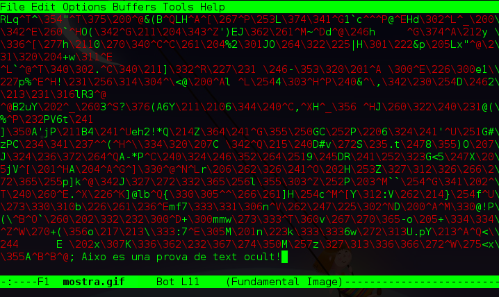

He conegut fa poc un concepte que no coneixia: _esteganografia_. La idea és ocultar una informació dins d'una imatge.  
Podem ocultar un text, o una altra imatge. Per poder dur a terme aquesta tècnica hi ha moltes eines, des de **steghide** o **outgess**. Les eines són molt completes i molt interessants. Però el que jo vull explicar aquí és com fer-ho des de la terminal, i d'una manera molt senzilla.  
Anem a fer un exemple.  

Ara vull desar un petit text dins d'una imatge, en aquest cas podriem usar una gif que ocupi molt poc espai:  
  

echo "text a afegir" >> mostra.gif

per llegir el que he posat:

tail mostra.gif

Una altra opció seria usar un editor tipus **emacs** o **vi(m)**. La idea és obrir la imatge amb l'editor i al final, escriure el text que volem!  
Per exemple amb Emacs ho he intentat des de mode gràfic i hem visualitza la imatge, així que he ober una terminal i he escrit:

emacs -nw mostra.gif

Ara vaig al final del text, en el meu cas he vist un **;** i a constinuació he escrit el que vull desar ocult en la imatge.  
  

També es poden afegir dins de videos, o d'altres documents. Si volem afegir una imatge dins d'una altra, doncs podriem posar alguna cosa com:

cat imatge1.git >> imatge2.gif

Així ens quedaria la imatge1 dins de la imatge2.

Crec que és una cosa força curiosa!

:-)
