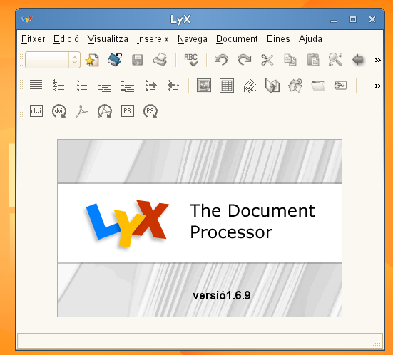
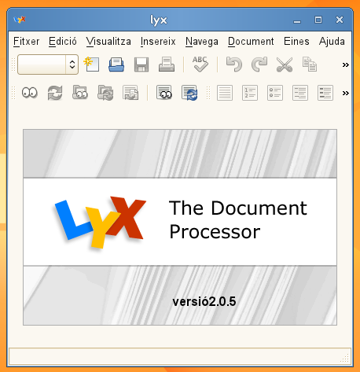
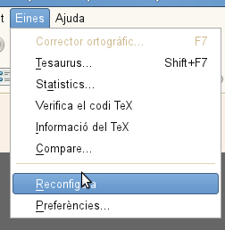
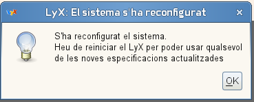

  
Aquests dies de vacances m'he posat a tafanejar una mica [LyX](http://www.lyx.org/WebEs.Home). És un programa pensat per realitzar documents usant la potència de [LateX](http://ca.wikipedia.org/wiki/LaTeX). Tot i que m'agrada molt el mode per **Emacs** anomenat [AucTeX](http://ca.wikipedia.org/wiki/AUCTEX),volia provar LyX.  
El primer que m'he trobat és que la versió que s'instal·la a la \*[Linkat Edu 11.4](http://linkat.xtec.cat/portal_linkat/wikilinkat/index.php/Linkat_Edu_11.4)\* és la 1.6.9  
  
I això, en un principi no és un problema, però quan he anat a un altre ordinador amb una altra versió més moderna, no s'obria després de nou a la Linkat, el document quedava actualitzat.  
Així que he decidit actualitzar la versió a la 2.0.5 i aprofitar totes les noves funcionalitats, i evitar el problema de versions.  

Res més fàcil que anar a la pàgina de LyX i a la part de descàrregues hi ha l'opció per [OpenSuse](http://wiki.lyx.org/LyX/LyXOnOpenSUSE), i allí trobem la d'11.4 que és la que volem. Amb un sol clic s'ens actualitza.  
I ara ja tenin la nova versió.  
  

Però en obrir el document de nou amb la versió actualitzada, m'ha sortit un problema amb el mòdul de tipus de documents :-(  
Per solucionar-ho, res més fàcil que anar a: eines > reconfigura  
  
I després d'una petita estona, ja tenim el LyX actualitzat i funcinonant a la Linkat Edu 11.4  
  

Ara només queda jugar amb el programa a veure que tal :-)
