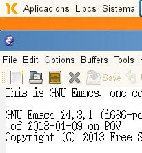

Després d'uns dies usant Emacs24 he passat a fer la instal·lació a la **Linkat 11.4**. No la tenim al repositori, així que per poder fer-ho la descarregarem directament de la pàgina oficial i ho compilarem. Un dels avantatges un cop instal·lat, és que des de la versió 24 podem gaudir dels [repositoris propis](http://croniqueslinux.wordpress.com/2013/04/05/instal%C2%B7lar-modes-en-emacs-24/), i així poder ampliar-lo amb nous modes, i mantenir-ho actualitzat.

Així que, el primer que caldrà és descarregar la última versió:

wget http://ftp.gul.es/gnu/ftp.gnu.org/gnu/emacs/emacs-24.3.tar.gz

un cop descarregat, cal descomprimir:

tar -xzvf emacs-24.3.tar.gz

i entrem a la carpeta:

cd emacs-24.3

Ara passem a Instal·lar-ho: Abans de compilar, caldrà executar **autogen** que farà una comprovació de les dependències i paquets:

$ ./autogen.sh

Inicialment m'ha donat alguns problemes de dependències:

Your system has the required tools, running autoreconf...
./autogen.sh: line 211: autoreconf: no s'ha trobat l'ordre

Així que he mirat i he vist que no hi ha l'ordre autoreconf! Em feia falta tenir algunes dependències per fer les compilacions!

zypper in autogen autoconf build-essential  automake libtiff-devel giflib-devel ncurses-devel

Seguidament ens diu:

Your system has the required tools, running autoreconf...
You can now run \`./configure'.

Ara tot està correcte!!! Passem a compilar!

$ ./configure
$ make
$ su
$ make install

Després d'una bona estona….

Ja tenim l'Emacs24 a la Linkat!

;-)
