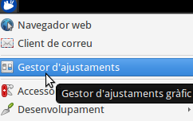
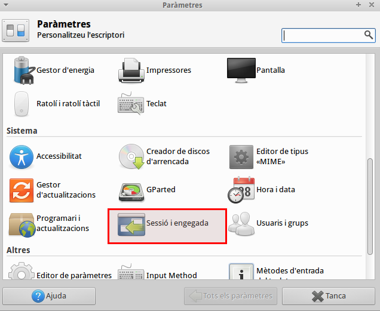
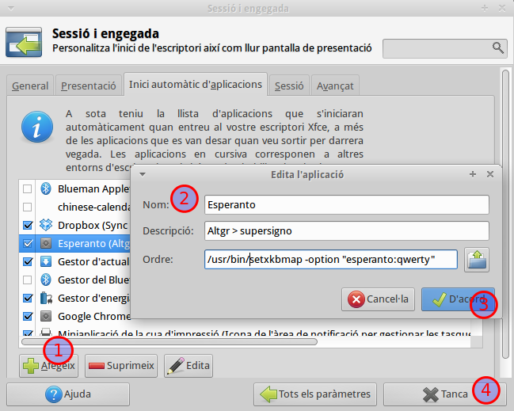

Ja fa un temps que estudio Esperanto i em calia poder escriure el "supersigno", així que al portàtil on tinc instal·lat **Xubuntu** no trobava com configurar-ho. En Gnome és senzill, ho trobem en la configuració del teclat i en les opcions podem triar esperanto - supersigno en l'opció qwerty, és a dir, que amb la tecla \[alt gr\] i prement la lletra que porta supersigno, ens surt ĝ, ŝ, ŭ … En Lubuntu i entorns lxde es pot fer com ho explicava per fer [accents en un teclat americà](http://croniqueslinux.wordpress.com/2012/12/25/accents-amb-un-teclat-america/). Només cal posar:

@setxkbmap -option "esperanto:qwerty"

En el cas de Xubuntu, he partit de la mateixa idea anterior, configurant-ho directament amb el **setxkbmap**.  
Els passos que he seguit:

Primer cal obrir "El Gestor d'ajustaments"

Tot seguit, anem a "Sessió i engegada"

Finalment anem a la pestanya "Inici automàtic d'aplicacions",

1\. Afegim una comanda
2. Posem un nom, una descripció i la comanda: 
/usr/bin/setxkbmap -option "esperanto:qwerty"
3. Fem d'acord i
4. tanquem

Ara, la propera vegada que reiniciem l'ordinador, ja tindrem habilitat el **supersigno**.
