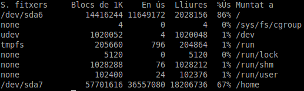

Hi ha moltes eines per saber l'espai del disc, tant en ús com l'espai lliure. Però moltes vegades no tenim accés a un entorn gràfic. Des de terminal tenim varies eines que ens permeten saber l'espai que tenim lliure i en ús. Dues de les dues més importants són **du** i **df**.  
Per saber-ne més, només cal usar el propi manual:

man du 

o

man df

### Espai que tenim lliure i en ús

La comanda **df** ens ajuda a saber l'espai lliure en el disc. Per defecte, només amb la comanda:

df

veurem l'espai que hi ha lliure a totes les particions, i alhora ens mostra l'espai usat en percentatge.  
Un exemple de sortida de la comanda és:  

Amb l'opció **\-h** tindrem la sortida en Gb, Mb i Kb. Amb la comanda **\-T** ens diu el tipus de sistema de fitxer. Si volem veure la informació d'un disc, només cal:

df /dev/sdXX

### Mesurar l'espai dels directoris

La comanda **du** ens ajuda a saber l'espai ocupat dels directoris. Primer fa una lectura total (de directoris visibles i també dels ocults), força lent, podem usar el paràmetre -sh per que només ens doni el resultat total:

du -sh

Amb el paràmetre -S ens mostra la mesura total de cada directori, inclosos els subdirectoris. Si volem saber l'espai ocupat per un firectori ocupat, cal posar l'adreça del directori:

du -h /home/usuari/Baixades

També podem visualitzar varis directoris a la vegada amb la comanda **\-c**:

du -sch /home /var

### Fonts:

**HUGHES, P.; NAVRATILOVA, V.** (2000). _Linux for dummies: Quick reference_. Indianapolis: Wiley Publishing.

**ANGUIANO, E.; CAMACHO, D.; NAVARRETE, C.** (2008). _Guía de aprendizaje Linux._ Madrid: Pearson Educación.

**NEGUS, C.; CAEN, F.** (2008). _Fedora Linux: Toolbox._ Indianapolis: Wiley Publishing.
