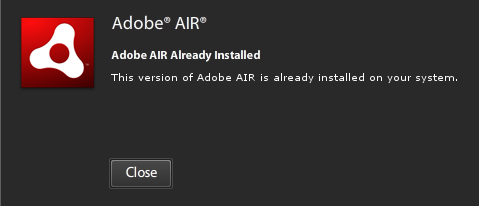
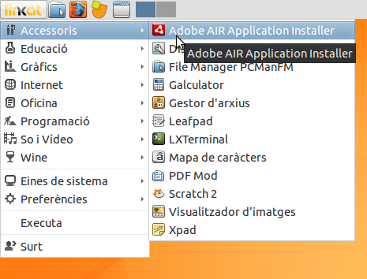
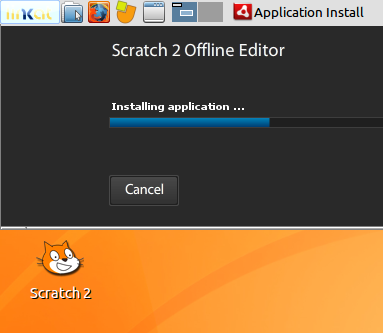

Scratch és un entorn de programació educatiu fet al MIT, i que en el món educatiu ens permet treballar el pensmanet computacional. El tenim per programar en línia a [https://scratch.mit.edu](https://scratch.mit.edu) , tot i això, a mi m'agrada poder treballar offline. Per fer-ho he seguit les instruccions de la seva pàgina [https://scratch.mit.edu/scratch2download/](https://scratch.mit.edu/scratch2download/)

Axí que quan he intentat instal·lar-ho a la **Linkat lleugera**, però m'ha donat problemes, on em demana que instal·li el gnome keyring… que ja em consta com a instal·lat.

Al final de molt remenar, he trobat la solució:

1. primer cal donar permisos d'execussió:

chmod +x AdobeAIRInstaller.bin                                                                                            

1. i després des de la terminal (si és de 32 bits)

LD\_LIBRARY\_PATH=/usr/lib/i386-linux-gnu ./AdobeAIRInstaller.bin           

Si és de 64 bits:

LD\_LIBRARY\_PATH=/usr/lib/x86\_64-linux-gnu ./AdobeAIRInstaller.bin

i ara ja podem seguir les instruccions habituals de Scratch 2, usar l'Adobe Air per instal·lar el paquet _Scratch-441.air_  

;-)
