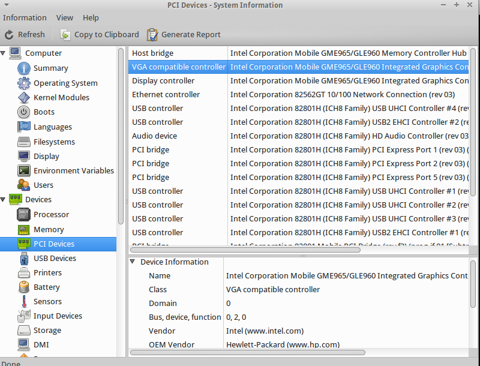

Des de que he instal·lat **xUbuntu 15.04** al meu vell portàtil **hp 550** que quan inicio per primera vegada el **Youtube** es penja la gràfica. Abans amb la versió **14.04 LTS** no m'havia passat. Així que el primer que he revisat és la gràfica que tinc posada. Ací explico com saber la gràfica.

Anem a veure com puc saber la gràfica:

des de la terminal escrivim:

lspci | grep Graphics

i surt:

VGA compatible controller: Intel Corporation Mobile GME965/GLE960 Integrated Graphics Controller 

o també podem usar la comanda ****lshw****:

lshw | grep Graphics

i ens mostra:

product: Mobile GME965/GLE960 Integrated Graphics Controller

i si volem gràficament (_GUI_), també podem usar el programa ****hardinfo**** , si no el tenim instal·lat, podem instal·lar-lo:

sudo apt-get install hardinfo

;-)

PD: _Quan trobi la solució del problema, ho penjaré al blog._
