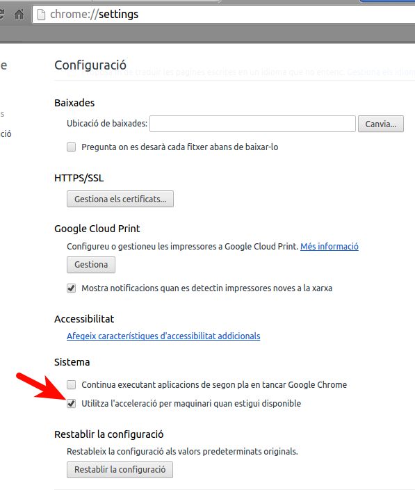

Ja fa uns dies que tinc problemes amb el Youtube. Quan inicio un video en el HP550, als poc segons es penja, se sent de fons, però no es veu res.

He provat moltes coses, actualitzacions, i demés. Resulta que tinc un Lubuntu 14.04.3 instal·lat, i llegint als fòrums sembla que en la última actualització han hagut canvis i ací hi ha el problema, que ara no suporta bé l'acceleració GPU ... M'he adonat que el problema passa funcionant el Youtube en el Chrome, però amb el Mozilla Firefox, funciona!

Llavors ho he desactivat l'acceleració de maquinari al Chrome:

I ja està funcionant de nou!

;-)
