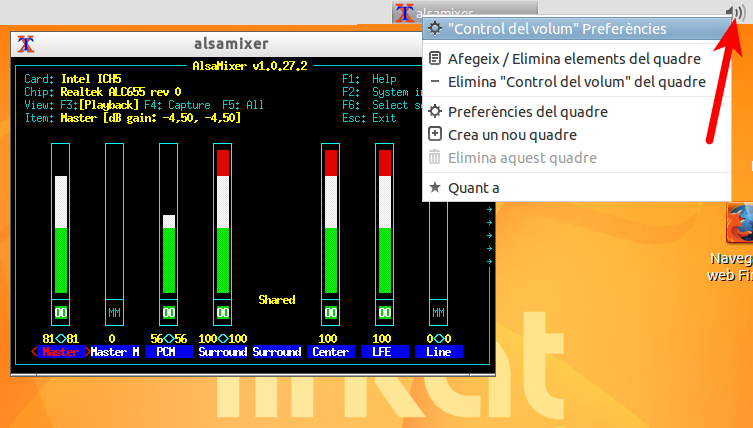
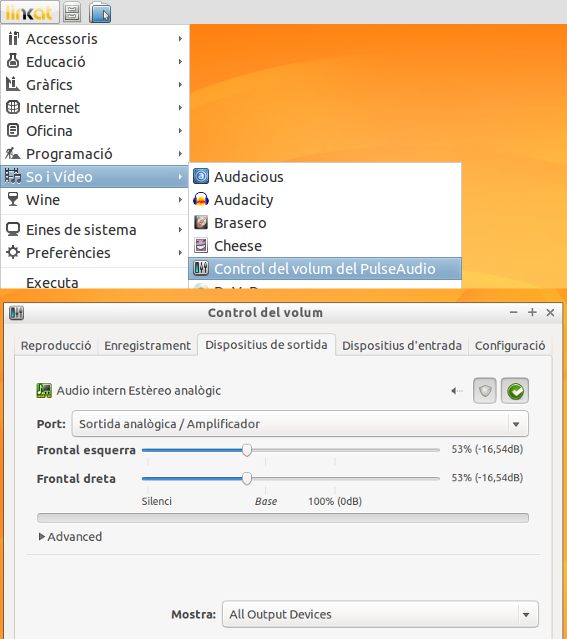

Estic molt content amb la [Linkat lleugera](http://linkat.xtec.cat/portal_linkat/wikilinkat/index.php/Linkat_lleugera).

Però l’altre dia em vaig trobar que es feia una mica complex per a una persona, que no ha usat mai linux, fer canvis del control de volum. Uns companys volien activar i desactivar el volum del micròfon… Quan fas clic a la icona del volum de la barra superior, et trobes un control en terminal:



Remenant una mica, i veient com altres usuaris d’entorns **LXDE** ho havien solucionat, ho he provat amb la _Linkat_ Lleugera. Suposo que serveix per a Lubuntu i d'altres. La solució ha estat instal·lar tres programes:

> ```
> sudo apt-get install pulseaudio pavucontrol pavumeter
> ```

I ara ens ha quedat un control de volum senzill:



;-)
